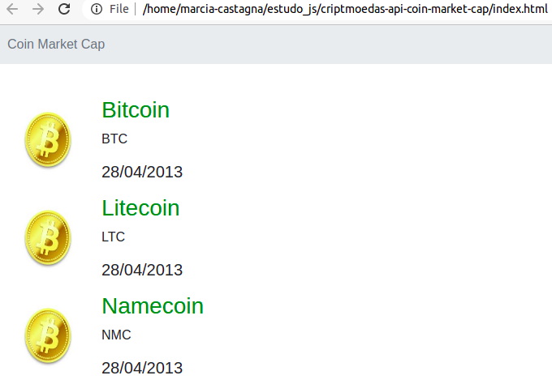

# Requisitando dados da API de criptomoedas Coin Market Cap

## Coin Market Cap API

1. Criar a conta de desenvolvedor

   [Portal do desenvolvedor Coin Market Cap](https://pro.coinmarketcap.com/login?returnUrl=%2Faccount)

2. Obter a API Key

## Desenvolvimento

- Utilizando método 'fetch' disponível no javascript para realizar a requisição

  - Método nativo

- Para essa API, é necessário adicionar a extensão [Moesif Origin & CORS Changer](https://chrome.google.com/webstore/detail/moesif-origin-cors-change/digfbfaphojjndkpccljibejjbppifbc) no Google Chrome
  - Ir no ícone da extensão e "**ligar**"
  - Sem a extensão instalada e ligada, ocorre esse erro:

```
    Access to fetch at 'https://pro-api.coinmarketcap.com/v1/cryptocurrency/map?CMC_PRO_API_KEY=SUA-API-KEY' from origin 'null' has been blocked by CORS policy: No 'Access-Control-Allow-Origin' header is present on the requested resource. If an opaque response serves your needs, set the request's mode to 'no-cors' to fetch the resource with CORS disabled.

```

## Visualizando no navegador



## Referência

- [API Coin Market Cap](https://coinmarketcap.com/api/documentation/v1/#)
- [API Coin Market Cap - Autenticação](https://coinmarketcap.com/api/documentation/v1/#section/Authentication)
